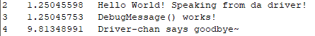

# KernelDriver
Another poor attempt at bypassing Epic's (Epic Online Services) Easy Anti-Cheat.
I had no prior knowledge on anything needed to make this work (writing and reading memory, and more), so I'm learning on the go, and any help, in information or commits is very welcomed.
So far I've managed to output from the Kernel Driver, it's not much but we're getting somewhere at least.

Once again, any commits or feedback is very welcomed.
Use this freely as long as you honor the license used
