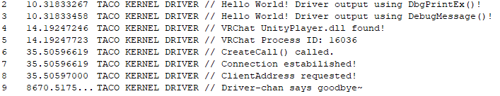

# KernelDriver
Another poor attempt at bypassing Epic's (Epic Online Services) Easy Anti-Cheat. (for VRChat, but can probably be used in other games)

I had no prior knowledge on anything needed to make this work (writing and reading memory, and more), so I'm learning on the go, and any help, in information or contribution are very welcomed.
So far I've managed to output from the Kernel Driver, it's not much but we're getting somewhere at least.

Once again, any pull requests or feedback are very welcomed. You can find my twitter in my profile.
Keep in mind I'm not responsible for what you do with this. With that said, use this freely as long as you abide by the license used.
